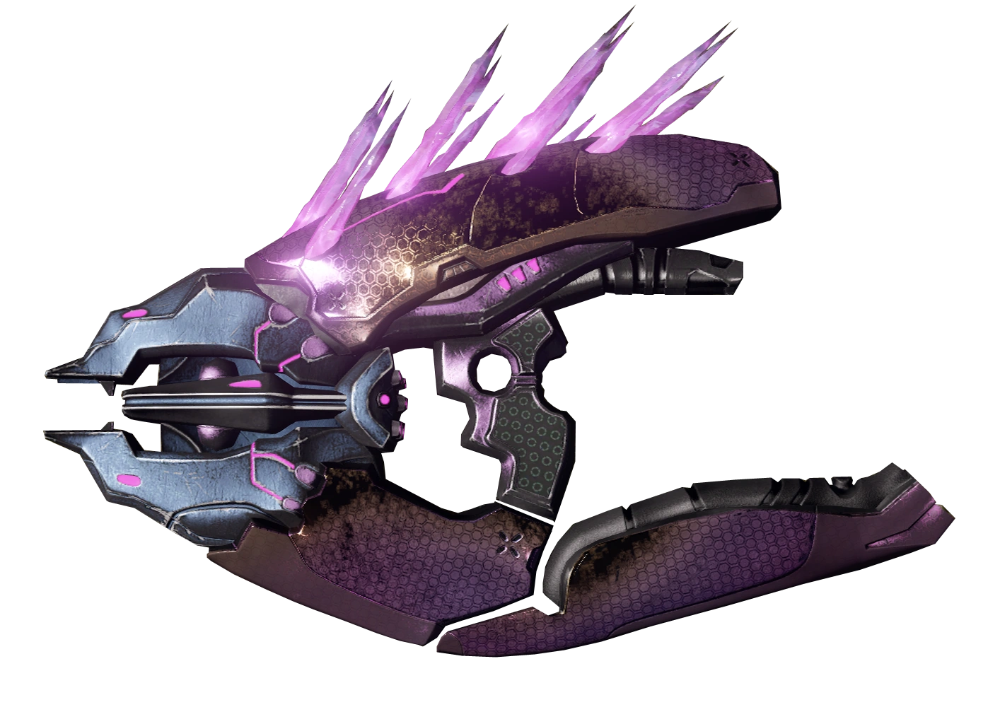
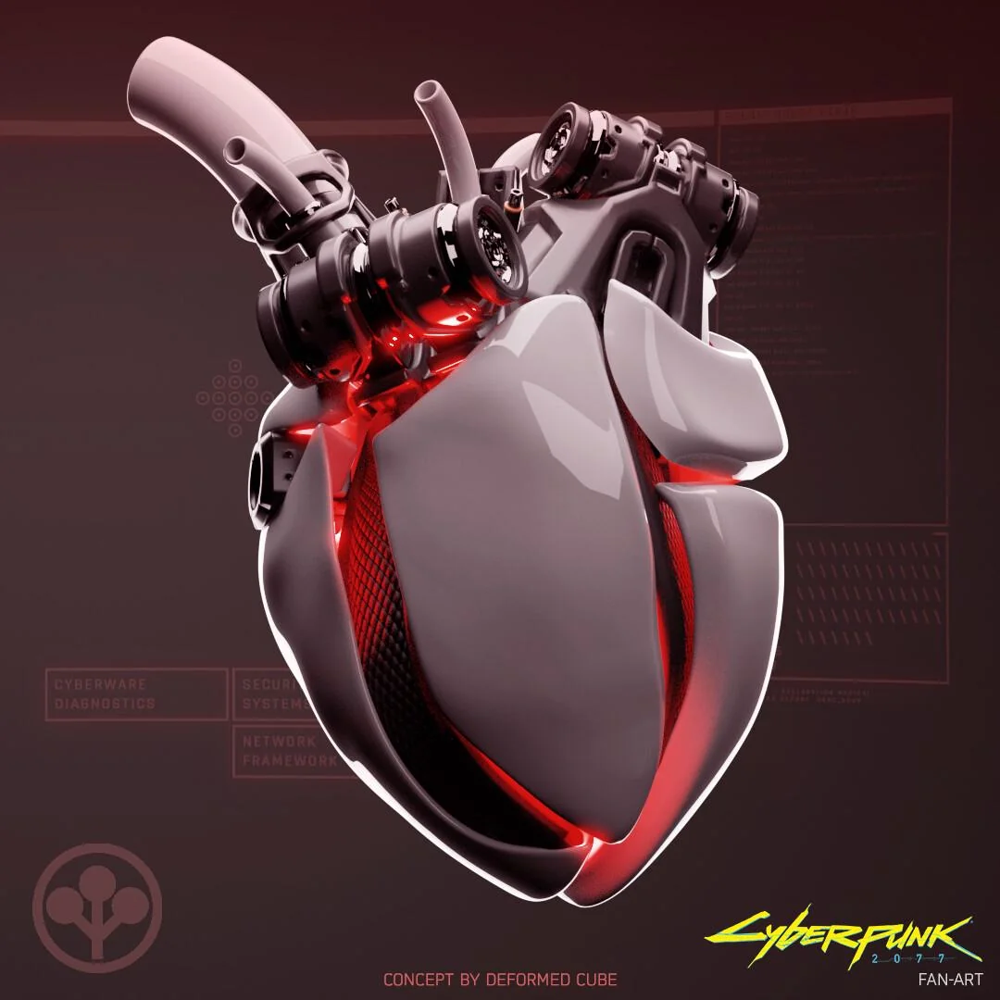
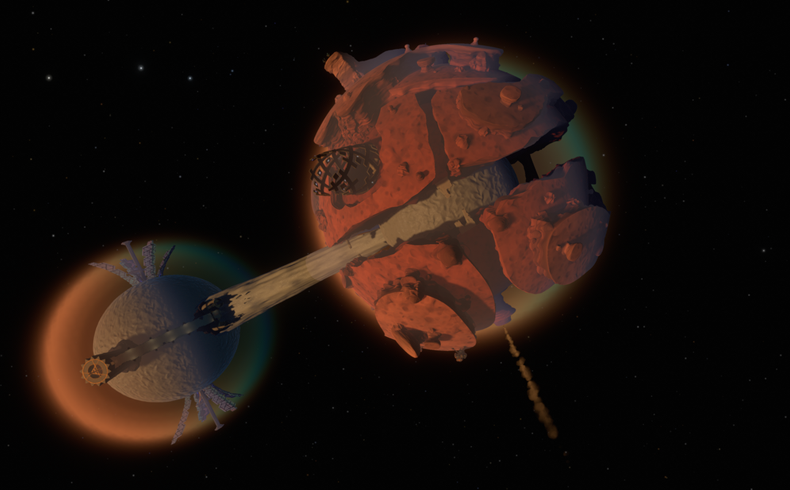
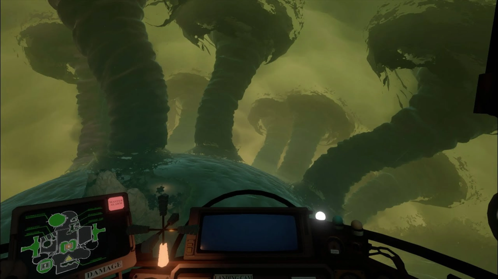

# Bitacora

## Ideas
- Arma
- Nucleo de poder
- Casa (Magica)
- Herramienta especial
- Robot
- Transporte

### Top 3
- Arma: Tenemos la intencion de de realizar un arma basada en algun mineral y sin municion ni polvora convencional, como referencias de ellos tenemos las armas de halo, las cuales funcionan con cristales que explotan con el tiempo. en la simulacion se utilizarian sus disparos para dar las estadisticas y analisis de datos como potencia, distancia, etc. Descartado por el complejo acceso a informacion importante ya que al estar relacionado con la creacion de armas y explosivos, se limita pr seguridad (terrorismo) 

- Robot: Un robot de aspecto simple que sirva como compañero y ayudante del hogar, se planeaba para la muestra conectarlo a chatgpt o algun otro tipo de IA para que este pudiera interactuar directamente con el usuario en un programa tipo tamagochi

- Organo: Una mejora sintetica de un organo (investigado especificamente el corazon) el cual brindaria no solo un remplazo a un organo defectuoso si no que entrando el campo de la ciencia ficcion, fuera capaz de superarla, para esto se investigo que otras funciones tiene el corazon aparte del bombeo de sangre para hacerlo un poco mas realista. trabajos como la produccion de hormonas, una coneccion directa con el cerebro y la produccion de electricidad fueron algunas de las mas interesantes para trabajar

### Idea extra
- Ecosistema: planteamos la creacion de un planeta el cual tendria su propia fauna/flora y estructura interna, limitada y simple, como ejemplo de ello tomamos el videojuego Outer wilds, el cual posee planetas muy sencillos pero interesantes explotando alguna caracteristica como: un sistema binario en el cual un planeta lanza arena al otro y despues vuelve, una de solo agua donde el unico animal es una medusa y las corrientes lazan las pocas islas hasta el espacio, o un planeta que se rompe porque su luna lanza meteoritos y solo posee capa superficial 

## Enfoque

- El producto sera realizado bajo el contexto de un planeta artificial el cual esta en venta por su singularidad y fenomenos fisicos unicos 

# Exploracion de guion

Posibles contenidos:

Titulos:
### Planeta "Nombre"
### Singularidad/Fenomeno Fisico
 
 - Explicacion del agujero blanco, los campos magneticos que mantienen la estabilidad del planetay la atmosfera
 - como estan distribuidas las placas magneticas y como se aprovecha la energia del agujero blanco para el funcionamiento del planeta
 ### Geografia
 - distribucion de islas flotantes y puntos de interes
 ### Ecosistema
- las 2 especies animales que habitan el planeta, como se adaptan a la vida en el planeta y como interactuan entre si
- La especie vegetal que habita el planeta, como se adapta a la vida en el planeta, su interaccion con la especie animal y su participacion en el ciclo dia y noche 

